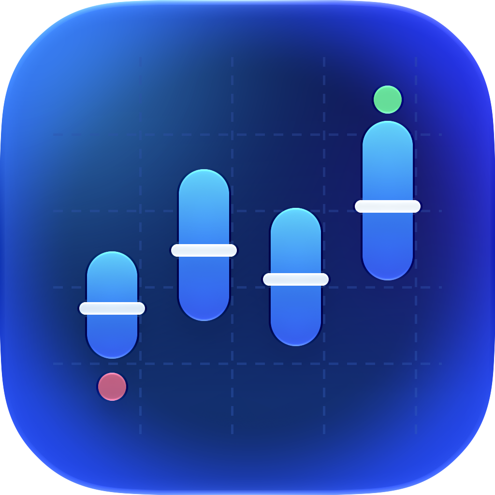

<p align="center">
  
</p>

# SessionMonitor

**Видеть, куда уходят токены и квота Codex, и узнавать о проблеме во время работы, а не постфактум.**

Нативное macOS-приложение и CLI. Читает локальные логи сессий Codex (`~/.codex/sessions`), считает
реальный расход без двойного учёта, находит аномалии и предупреждает, пока ещё можно что-то
изменить. Всё работает локально: prompts и вывод инструментов не сохраняются, в сеть ничего не уходит.

## Знакомо?

Одна неделя работы автора с Codex (5–12 сентября 2026): **6 340 запросов и 775 млн input-токенов**.
Cache hit — 96%, и это выглядело как «всё отлично». На деле объём определяли частые вызовы в больших
сессиях, а в одном эпизоде агент **18 раз подряд ждал одну и ту же ячейку кода** за пять минут.
Наивный подсчёт по логам ещё и завышал расход: форки копируют историю родительской сессии.

| Боль | Что делает SessionMonitor |
| --- | --- |
| Квота кончается посреди задачи, и узнаёшь об этом, когда уже поздно | Показывает остаток по окнам (5 часов, неделя) и время reset. Предупреждает при остатке ≤20% и ≤5% и при резком ускорении расхода |
| Непонятно, куда ушли сотни миллионов токенов | Отчёты по сессиям, моделям и подагентам за любой период; находит сессию, которая съела основную долю |
| «Cache hit 96% — значит, дёшево» | Показывает абсолютный объём рядом с cache hit. Высокий cache hit не выдаётся за экономию |
| Агент крутится в цикле ожиданий, раздувает контекст или дорого стартует | Находит повторяющийся polling, дорогой первый turn, всплески некэшированного input и обвалы кэша — с указанием конкретных запросов |
| Цифры не сходятся: копии истории форков, дубли, обрывки строк | Учитывает каждый запрос один раз, отбрасывает скопированную историю, а неизвестное показывает как «неизвестно», а не как 0 |
| О проблеме узнаёшь на следующий день | Watch импортирует логи по мере записи, оценивает сигналы после каждого импорта и присылает уведомление macOS |
| Агент сам не знает, что расходует слишком много | Hook `codex-monitor agent hook` для Codex и Claude Code добавляет в контекст агента алерты его сессии и квоты; `agent status` даёт ту же сводку скриптам и CI |

Находки опираются на конкретные запросы и строки логов и помечены уровнем уверенности.
Если данных не хватает, SessionMonitor так и говорит, вместо того чтобы угадывать.

## Быстрый старт

Нужны macOS 15+ и Xcode с Swift 6. Команды выполняются из корня репозитория.

```sh
# 1. Собрать CLI и положить его в PATH
make build-cli-release
mkdir -p ~/.local/bin   # каталог должен быть в PATH
install -m 755 "$(swift build -c release --show-bin-path)/codex-monitor" ~/.local/bin/

# 2. Импортировать историю сессий Codex (повторный запуск читает только новое)
codex-monitor import ~/.codex/sessions

# 3. Куда ушли токены за последнюю неделю
WEEK="$(date -u -v-7d +%Y-%m-%dT%H:%M:%SZ)"
codex-monitor report --since "$WEEK"
codex-monitor sessions --since "$WEEK" --sort input   # самые дорогие сессии сверху
codex-monitor doctor --since "$WEEK"                  # аномалии с доказательствами
codex-monitor quota                                   # остаток квоты и время reset

# 4. Следить в реальном времени и получать алерты
codex-monitor watch ~/.codex/sessions --alerts        # строки {"alert": ...} после каждого импорта
codex-monitor alerts                                  # активные алерты
```

Приложение: `make generate`, затем соберите схему `MonitorMac` в Xcode. В menu bar выберите
**Watch → папку `~/.codex/sessions`** и разрешите уведомления. Приложение будет импортировать новые
логи, проверять сигналы после каждого импорта и показывать уведомления. CLI и приложение работают
с одной базой (`~/Library/Application Support/SessionMonitor/usage.sqlite`) и видят одни и те же данные;
суммы совпадут при одинаковых периоде и аккаунте (приложение по умолчанию показывает всё время, а
`report --since` — только выбранный период). Одновременно импортировать в базу может только один watch.

Что считается сигналом:

- аномалии сессий за последние 6 часов: polling, дорогой старт, обвал кэша, всплеск некэшированного
  input, очень большой расход, доминирующая сессия;
- квота: резкое ускорение расхода за последний час, остаток ≤20% (предупреждение) и ≤5% (ошибка), а также
  прогноз: при текущем темпе окно закончится раньше своего сброса (ошибка, если до исчерпания меньше 30 минут);
- живые правила для идущей сессии (SM-327), пороги берутся из **вашей** истории за 14 дней, а не из констант:
  темп input в минуту заметно выше вашего обычного напряжённого темпа, необычно много запросов подряд без
  реплики человека, input запроса растёт без компактации и дошёл до вашего обычного «большого» запроса
  (только info). Если истории мало или input у части запросов неизвестен, правило молчит;
- проблемы с самими данными: битые или неполные записи;
- здоровье watch: ошибка или восстановление после ошибки;
- cache hit ниже порога — только информационно, без уведомления: низкий кэш сам по себе не доказывает
  лишний расход.

Пока условие держится, повторных уведомлений нет; если оно «мигает», срабатывает пауза (cooldown).
Частота уведомлений ограничена, сначала проходят более серьёзные.

## Возможности подробно

- Потоковое чтение локальных JSONL через Foundation/Codable без сохранения prompts и tool outputs.
- Проверка ownership с учётом fork replay, глобальный dedup по response ID и диагностика конфликтов.
- Persistent checkpoints: неизменённые файлы пропускаются без чтения тела, append продолжает decoder после restart.
- GRDB/SQLite: records, diagnostics и checkpoint фиксируются одной транзакцией; WAL и один importer на БД.
- CLI `import` и `report`: text/JSON, период `[since, until)`, общие и посессионные суммы.
- CLI `watch`: native FSEvents, bounded debounce, retry/reconciliation и pause/resume/stop.
- Versioned `snapshot` / `snapshot --follow`: общие query metadata и live updates в GUI от external commits.
- CLI `quota`: read-only usage-limit observations из импортированных rollouts; показывает observed used,
  derived remaining, reset и freshness. Отсутствующие/неподдерживаемые данные остаются unknown;
  сетевого polling нет.
- Alerts (SM-324/SM-325): общий для CLI/GUI/агентов state machine raise/escalate/update/resolve с dedup по
  стабильному ключу, cooldown, rate limit, muted kinds и подавлением unknown coverage; состояние и durable
  outbox в SQLite не меняют canonical totals и watermark. Сигналы берутся из существующей аналитики за
  последние 6 часов: anomaly findings `doctor` по сессиям, database-wide diagnostics, свежие quota
  `sharp_shift`, низкий остаток quota (≤20% warning, ≤5% error; stale — unknown coverage), cache hit ниже
  порога (только info), здоровье watch и живые правила SM-327 (burn rate, runaway loop, рост input,
  проекция квоты до сброса; baseline — из ваших прошлых сессий, перестраивается раз в 30 минут). CLI: `alerts [list] [--status active|resolved|all] [--json]`,
  `alerts evaluate [--lookback-hours N] [--json]`, `watch --alerts` (строки `{"alert": ...}` после каждого
  импорта). Приложение оценивает сигналы после каждого импорта своего watch и показывает уведомления macOS
  для событий с `notify = true`.
- CLI `agent status` и `agent hook` (SM-328): компактный статус сессии и hook-адаптер для Codex и Claude Code
  (`additionalContext` только при алертах). См. раздел Agent status.
- CLI `profiles`: явное сопоставление однородного каталога источников с локальным account profile;
  `report`, `activity` и `quota` поддерживают `--profile ID` и `--unknown-or-mixed`.
- GUI account scope selector общий для Session Explorer и menu bar, сохраняется между запусками и предлагает
  `All accounts`, mapped profile или `Unknown/Mixed`. В `All accounts` activity помечена явно,
  а quota windows сгруппированы по профилям и никогда не объединяются между ними.
- Input/cache/output и optional cache-write/reasoning/total counters. Unknown не превращается в ноль.
- SpecificationCore для coverage policy; SpecificationKit `@ObservedSatisfies` в GUI.
- Native split navigation, фильтр по session ID/model, inspector и независимое состояние окон.
- MenuBarExtra: read-only сводка tokens, cache coverage, периода и времени обновления индекса.
- SwiftLint, FSD architecture lint, Makefile, XcodeGen и подписанная development app.

## Сборка и запуск

При работе из Codex с открытым Xcode основной интерфейс — подключённый MCP
`xcode-tools` через XcodeMCPWrapper broker. Проверены 43 доступных tools и успешные
`XcodeListWindows`, `XcodeListSchemes`, `GetTestList`. Выбирать workspace tab и scheme
перед `BuildProject`, `RunProject`, `RunAllTests` и debugger operations.
`SessionMonitor-Package` — Swift package с 91 core tests; GUI и 73 GUI/model/render tests
находятся в `Apps/MonitorMac/MonitorMac.xcodeproj`, схема `MonitorMac`.
XcodeBuildMCP CLI остаётся дополнительным build path; это отдельный инструмент.

Проверено: Xcode 27 beta (`27A5209h`), Swift 6.4, macOS arm64; deployment target macOS 15.
Инструменты: SwiftLint 0.63.3, XcodeGen 2.46.0, fsd-ios 0.4.0, XcodeBuildMCP 2.7.0.
Runtime dependencies разрешаются через SwiftPM; локальная compatibility dependency описана ниже.

```sh
make check-core           # Swift CLI build, SwiftLint, 91 core tests и CLI process smoke
make test-cli             # CLI signals/backpressure smoke после build-cli; Python 3 standard library
make build-mcp            # GUI build через XcodeBuildMCP CLI
make test-macos           # xcodebuild + 73 GUI/model/render tests
make lint-architecture    # FSD strict architecture gate
make check                # Полный последовательный набор локальных проверок
make ci                   # Те же native gates, locked packages и ad-hoc signing
make lint-ci              # Проверка GitHub workflow (нужен actionlint)
make check-linux          # Linux: CLI build, core tests и CLI smoke без Xcode и GUI
```

CLI `codex-monitor` собирается и на Linux (Swift 6.2, проверено на Ubuntu 24.04; GitHub CI
job `Linux CLI checks`): `swift build --product codex-monitor`. Отличия от macOS: `watch`
опрашивает каталог раз в 2 секунды вместо FSEvents, у файлов нет birth time (identity —
device+inode), App Group snapshot для виджета не пишется. GUI, виджет и уведомления — только macOS.

`make generate` создаёт `Apps/MonitorMac/MonitorMac.xcodeproj` из versioned `project.yml`.
Оба SwiftPM graphs закреплены в root `Package.resolved` и `Apps/MonitorMac/Package.resolved`.
Локальная подпись настраивается в игнорируемом `Apps/MonitorMac/Local.xcconfig`:

```xcconfig
DEVELOPMENT_TEAM = YOUR_TEAM_ID
CODE_SIGN_IDENTITY = Apple Development
```

На текущем Mac Team получена из существующего valid certificate. На новом checkout
создаётся конфигурация для ad-hoc development build. Makefile использует
`-skipMacroValidation` для известных pinned macros SpecificationCore/Kit, как
XcodeBuildMCP; глобальные Xcode trust settings не меняются. После ручного разрешения
macros в Xcode можно передать `XCODEBUILD_FLAGS=`.

```sh
swift run codex-monitor import ~/.codex/sessions
swift run codex-monitor import ~/.codex/sessions --rescan  # Принудительно пересобрать снимки
swift run codex-monitor watch ~/.codex/sessions
swift run codex-monitor report --since 2026-09-05T05:27:20Z --until 2026-09-12T05:27:20Z
swift run codex-monitor report --since 2026-09-11T21:00:00Z --until 2026-09-12T21:00:00Z --time-zone Europe/Moscow
swift run codex-monitor report --json
swift run codex-monitor snapshot --follow --time-zone Europe/Moscow
swift run codex-monitor quota --since 2026-09-13T00:00:00Z --json
swift run codex-monitor profiles map-root --root ~/.codex/account-work/sessions --id work --label Work
swift run codex-monitor report --profile work
swift run codex-monitor quota --profile work --json
swift run codex-monitor report --unknown-or-mixed
open .build/xcode/Build/Products/Debug/SessionMonitor.app
```

Account identity берётся только из явных non-secret полей rollout или из пользовательского mapping.
Не сопоставляйте общий каталог, если он содержит несколько аккаунтов: такие данные остаются
`Unknown/Mixed`. Session ownership и account profile — независимые понятия; credentials,
`auth.json`, cookies и prompts для этого не читаются и не сохраняются. Text/JSON отчёты показывают
выбранную область; неограниченный запрос явно помечается как `All accounts`.

В GUI выбранный account scope общий для Session Explorer и menu bar. Сессии без подтверждённой
attribution остаются в `Unknown/Mixed`; mixed source roots исключаются из отчёта выбранного профиля
и показывают предупреждение о неполном охвате. Для назначения profiles используйте CLI `profiles`.

`quota` читает только уже импортированные события `event_msg/token_count.rate_limits`.
`remaining` явно помечается как вычисленное из `used_percent`; thread context не считается
доказательством владения account/model-pool quota. Отсутствие event в выбранном интервале
означает unknown, а не нулевой расход. Подробнее: [SM-308a report](reports/SM-308a-quota-snapshot-ingestion.md).

CLI и GUI по умолчанию используют одну БД:
`~/Library/Application Support/SessionMonitor/usage.sqlite`
(на Linux — `$XDG_DATA_HOME/SessionMonitor/usage.sqlite`, по умолчанию `~/.local/share/...`).
CLI поддерживает `--database PATH`; переменная `SESSIONMONITOR_DATABASE` позволяет
обоим интерфейсам использовать отдельную БД для проверки. Архивные rollouts можно
импортировать отдельным запуском из `~/.codex/archived_sessions`.
Directory import рекурсивно выбирает `*.jsonl` и несжатые числовые архивы
`*.jsonl.1`, `*.jsonl.2` и т. п. Hidden files/directories, `*.jsonl.bak` и
сжатые `*.jsonl.gz` не выбираются; декомпрессия не реализована.

Повторный `import` использует checkpoint по каждому source path. JSON summary содержит
`ioMetrics`: фактически прочитанные bytes и количество skipped/resumed/rescanned files.
`records` и `diagnostics` описывают только этот запуск; общие суммы и diagnostics
хранящегося набора возвращает `report`. При unchanged import `records` равен 0.

При росте файла с той же identity importer считает его append-only и читает только
хвост от последнего обработанного newline, в том числе после перезапуска. Partial
строка перечитывается целиком вместе с новыми bytes; raw tail не сохраняется в SQLite.
Неизменённый файл читает 0 bytes. Замена, уменьшение и изменение metadata без роста
вызывают полный rescan. Checkpoint v1 при первом обновлении пересобирается в v2.

Перезапись старых строк одновременно с ростом файла автоматически не обнаруживается.
После ручного редактирования или восстановления логов используйте `import DIRECTORY --rescan`.
В SQLite сохраняется только нормализованное состояние decoder, без raw prompts и tool outputs.

## Watch

`watch DIRECTORY` регистрирует FSEvents до первого import. События объединяются в
окно 250 ms (`--debounce-milliseconds 1...60000`); новые события не продлевают его
бесконечно. Каждое обновление сверяет всё дерево через incremental importer.
Dropped/coalesced events также вызывают reconciliation, без принудительного чтения
тел неизменённых файлов. События во время импорта сохраняют запрос на следующий проход.

Команда выводит JSON status lines с `phase`, `completedImports`, `lastImport` и
ошибкой при recovery. `SIGUSR1` ставит watch на паузу и дожидается текущего import;
после статуса `paused` новый import не начинается. `SIGUSR2` возобновляет работу
с обязательной сверкой дерева. `Ctrl-C`/`SIGINT` и `SIGTERM` отменяют importer,
дожидаются cleanup и закрывают stream. При stdout backpressure завершение ждёт
вывода не более 250 ms после остановки watcher; последние status lines могут быть отброшены.

Root должен существовать при запуске. Наблюдение за его parent позволяет заметить
rename/delete/recreate; недоступность root или меняющийся во время
чтения файл дают явный `recovering` и повтор с backoff 1 → 2 → … → 30 s.
БД должна оставаться доступной при перемещении sources. Её файлы, WAL/SHM, import/setup locks
исключены из discovery и обычных событий, даже если БД названа `usage.jsonl`.
Hidden entries и неподдерживаемые файлы не вызывают обычный refresh.

Swift API: `try await monitor.watch(directory)` возвращает `SessionWatch` с
`updates` (один consumer, latest status), `status`, `pause()`, `resume()` и `stop()`.
Владелец обязан вызвать `await stop()` либо ожидать `waitUntilStopped()` в задаче,
чья отмена остановит watcher. Watch удерживает DB lock всё время, включая pause/recovery;
второй watch или одноразовый import получает `importerBusy`. Читатели продолжают работать.
Lock освобождается после завершения importer, а при аварии/SIGKILL — операционной системой.
Symlink к БД не создаёт отдельного владельца; lock files не удаляются при release.

## Agent status

`codex-monitor agent status` — компактная сводка для скриптов и агентов:
- расход сессии Codex за окно (по умолчанию 24 часа) и время простоя;
- активность за последние минуты: запросы, input, ожидания, compactions;
- активные алерты этой сессии плюс общие (квота, watch, диагностика);
- остаток квоты по окнам.

Prompts, вывод инструментов и пути к файлам в сводку не попадают. Команда только читает базу. С
`--evaluate` она сначала проверяет сигналы; уведомления приложения при этом не теряются.

```sh
codex-monitor agent status                              # самая свежая сессия за 24 часа
codex-monitor agent status --session ID --json          # конкретная сессия, JSON для скриптов
codex-monitor agent status --evaluate --fail-on warning # код выхода 2, если есть алерт ≥ warning
```

Данные свежие настолько, насколько свеж индекс (`index.ageSeconds`). Для живой работы нужен watch
(приложение или `codex-monitor watch`).

### Hook'и для Codex и Claude Code

`codex-monitor agent hook` — адаптер для hook'ов. Codex и Claude Code передают hook'у на stdin JSON с
`session_id`, `transcript_path` и `hook_event_name`. Если есть что сказать, адаптер отвечает
`{"hookSpecificOutput": {"hookEventName": …, "additionalContext": …}}`, и этот текст попадает в
контекст модели. Если сказать нечего, он молчит.

Что делает адаптер при каждом вызове:

1. Дочитывает **свой** rollout-файл (`transcript_path`) инкрементально, поэтому данные свежие даже без
   watch, и сразу пересчитывает сигналы, как watch после импорта (события уходят в outbox, уведомления
   доставит приложение). Если базу держит работающий watch, этот шаг пропускается: watch и так обновляет
   индекс и алерты.
2. Находит **свою** сессию: сначала по `session_id`, затем по сессиям из `transcript_path`. Чужую
   «самую свежую» сессию он не подставляет никогда.
3. Добавляет контекст, только если есть активный алерт уровня `--min-severity` (по умолчанию `warning`)
   или выше: алерт этой сессии либо общий (квота, watch, диагностика). Текст не длиннее 2 000 символов.
4. Всегда завершается с кодом 0: ошибки уходят в stderr, монитор никогда не блокирует агента.

**Codex** — `~/.codex/hooks.json` (или таблица `[hooks]` в `~/.codex/config.toml`):

```json
{
  "hooks": {
    "UserPromptSubmit": [
      { "hooks": [ { "type": "command", "command": "codex-monitor agent hook", "timeout": 10 } ] }
    ]
  }
}
```

Hook'и в Codex включает feature flag `hooks` (раньше он назывался `codex_hooks`). Если в вашей версии
hook'и выключены, добавьте `[features] hooks = true` в `config.toml`. Для Codex адаптер видит
собственную сессию агента: `session_id` и `transcript_path` указывают на тот самый rollout, который
индексирует SessionMonitor.

**Claude Code** — `~/.claude/settings.json` или `.claude/settings.json` проекта:

```json
{
  "hooks": {
    "UserPromptSubmit": [
      { "hooks": [ { "type": "command", "command": "codex-monitor agent hook", "timeout": 10 } ] }
    ]
  }
}
```

Сессии Claude Code SessionMonitor не индексирует. Поэтому здесь адаптер сообщает только общие алерты
(квота Codex, watch, диагностика) и прямо пишет, что это не его сессия. Это полезно, когда Claude Code
управляет работой Codex.

Почему `UserPromptSubmit`: событие срабатывает один раз за ход пользователя, до того как модель
начнёт работу, и в обоих клиентах может передать контекст. Для долгих автономных прогонов можно
дополнительно повесить адаптер на `PostToolUse`: оба клиента принимают там `additionalContext` в JSON,
но вызовов будет больше. Не используйте `Stop`: в Claude Code `additionalContext` на этом событии
продолжает разговор, и агент может зациклиться.

Проверить вручную, что увидит агент:

```sh
echo '{"session_id":"<id сессии Codex>","transcript_path":"<путь к rollout .jsonl>","hook_event_name":"UserPromptSubmit"}' \
  | codex-monitor agent hook --always
```

Флаги: `--always` выводит статус даже без алертов, `--min-severity info|warning|error` задаёт порог,
`--no-import` не трогает transcript, `--lookback-hours` (по умолчанию 6) задаёт окно расхода сессии.
Codex `notify` для этого не подходит: он запускает программу после хода агента, но её вывод агенту
не возвращается.

## Observable snapshots

`codex-monitor snapshot` выводит один JSON object, `snapshot --follow` — initial snapshot
и последующие изменения как JSON lines. Команда только читает index и не запускает importer.
Доступны `--since`, `--until`, `--time-zone` и `--database`; период остаётся абсолютным
`[since, until)`, timestamps требуют явный ISO 8601 offset, а IANA timezone сохраняется
как presentation metadata. По умолчанию используется UTC. `report` и `snapshot` разделяют
parser и validation этих параметров. `report --json` сохраняет прежний bare `UsageReport` для совместимости,
а canonical export с `query`, coverage и watermark выдаёт `snapshot`.

Контракт schema version 1 содержит `query`, `report`, `coverage` и `watermark`.
Coverage различает empty/partial/complete cache fields у canonical requests; это не
оценка полноты всего архива. Diagnostics относятся ко всем импортированным sources.
Watermark содержит database UUID, монотонный commit revision и optional committed-at.
Он обновляется атомарно с каждым изменённым source snapshot/checkpoint, включая diagnostics;
unchanged imports его не продвигают. У мигрированной БД revision начинается с 0 и дата неизвестна,
даже если прежние records уже есть. Source timestamps не используются как commit time.

GUI предлагает All Time, Today, Last 7 Days и Last 30 Days в UTC или текущей local
timezone. Calendar periods выравниваются по полуночи выбранной зоны, включая DST,
и сохраняются между запусками. Один app-owned scope применяется к окнам и menu bar;
поиск в sidebar только сужает видимый список и не меняет accounting totals.

Sidebar Cache Hit Rate следует выбранному периоду и аккаунту: Today — локальный
календарный день от 00:00 с часовыми buckets и локализованными подписями времени;
Last 7/30 Days — календарные дни общего отчёта. Today выбирает локальную timezone
при выборе и восстановлении; её можно явно изменить через общий scope. Пустые часы
сохраняют место на оси. Для All Time используется период из настроек cache widget.
Системные WidgetKit widgets сохраняют собственные периоды.

При наведении на день или час график подсвечивает интервал и показывает в строке над ним дату, взвешенное
среднее, диапазон и число сессий; без наведения там подсказка. Идентификаторы сессий не показываются
(это обезличенный график), интервал без данных назван прямо. Клик по интервалу — SM-713.


GUI и Swift API `monitor.snapshots(query:)` используют тот же контракт: SQLite/GRDB
раз в секунду читает только marker, а полный отчёт вычисляет при изменении. Все поля
snapshot читаются в одной транзакции. Это также видит commits других CLI/GUI процессов:
обычный GRDB ValueObservation сам по себе external writes не наблюдает. Stream хранит
последнее значение, может объединять промежуточные commits и прекращает работу при отмене
consumer task. Окна GUI владеют своими tasks; фильтр и selection сохраняются при обновлениях.

Watermark относится к committed index, а не к завершению полного directory scan или
свежести raw logs. Прямые SQL writes без marker не входят в поддерживаемый write API.
Замена файла самой БД требует закрыть и вновь открыть runtime; открытая SQLite connection
продолжает обращаться к своему файлу. Ошибка observation оставляет предыдущий GUI report
видимым и сообщается пользователю; повторное открытие окна создаёт новый stream.

## Menu bar

Значок SessionMonitor открывает компактную панель: выбранный в приложении
период/timezone, input/output tokens, известный cached input, cache coverage и время
последнего commit в индексе (локальное время). Unknown cache остаётся unknown;
cached input не прибавляется к input повторно. Время индекса не доказывает свежесть logs.

Окна и панель используют один upstream stream на одинаковый `UsageQuery`. Открытие панели
не запускает importer, rescan или дополнительный polling stream, пока окно уже наблюдает
тот же query. Разные queries изолированы; при отсутствии подписчиков их stream отменяется.
Повторное открытие читает текущую БД. Навигация и sidebar search каждого окна независимы,
а accounting scope общий для приложения.
После ошибки сохраняется последний snapshot с предупреждением; повторное открытие
панели повторяет подписку. Ошибки не подменяются нулевыми totals.

**Watch Folder…** выбирает папку и явно запускает её import/watch. Панель показывает
состояние этого watcher и предлагает Pause/Resume и Stop Watch. Внешний CLI-watch
из GUI не управляется; занятый importer lock отображается как ошибка запуска.
Pause сохраняет ownership индекса, поэтому ручной импорт в это время может вернуть
ошибку занятого importer. **Refresh** только перечитывает snapshot, без import/rescan.

**Open Window** открывает Session Explorer. **Settings…** позволяет скрыть или вернуть
значок; эта настройка сохраняется. Закрытие окна и скрытие значка не останавливают
watch. **Quit SessionMonitor**, включая стандартный Quit приложения, ожидает остановку
watch и освобождение runtime. После повторного запуска watch нужно включить явно.
Bundle IDs: `ru.egormerkushev.session-monitor` и `ru.egormerkushev.SessionMonitor.Tests`.
Видимое product name и заголовок окна — `SessionMonitor`; `Session Explorer` — название
функциональной области, а `MonitorMac` используется только для Xcode project/target/scheme.

## Performance baseline

[SM-105: результаты на реальном архиве](docs/performance/2026-09-12-append.md):
155 files / 1,286,230,037 bytes, median fresh import 6.13 s, unchanged 0.02 s / 0 bytes.
Append 752 bytes читает ровно 752 bytes, median 0.02 s; применяется append-only контракт выше.
Audit parity: 6,340 requests и все шесть token totals. [Команда и методика](docs/performance/README.md).
`make benchmark` использует отдельные копии/БД; в CI запускается только synthetic smoke.

## Локальная загрузка в App Store Connect

Публикация сборок пока выполняется только с локального Mac. GitHub Actions не получает
App Store Connect credentials и не загружает release artifacts.

Авторизуйте `asc` локально через Keychain, затем выполните:

```sh
make release-local
```

Перед первым export локальному Mac нужны оба distribution identity с private keys
в Keychain: `Mac App Distribution` и `Mac Installer Distribution`. Также нужен
профиль типа `Mac App Store Connect` для explicit App ID
`ru.egormerkushev.session-monitor`, содержащий `Mac App Distribution` certificate.
Проверить локально установленные профили можно так:

```sh
asc profiles local list \
  --bundle-id ru.egormerkushev.session-monitor \
  --output table
```

App Store Connect API key, используемый `asc` для доступа и upload, не заменяет
distribution signing identity. Все API keys, private keys и signing assets остаются
в локальном Keychain/профильном хранилище; не добавляйте их, скачанные профили,
сертификаты или локальные `.xcarchive`/`.pkg` в GitHub.

Скрипт проверяет App Store ID `6812366729`, bundle ID
`ru.egormerkushev.session-monitor`, создаёт подписанный macOS archive и `.pkg` в
игнорируемом `.build/release-local`, а перед upload запрашивает подтверждение.
`--archive-only` создаёт archive и экспортирует `.pkg`, но пропускает upload:

```sh
scripts/release-local.sh --archive-only
```

Если Xcode не находит подходящий локальный профиль, разрешите ему обновить provisioning
assets из Developer Portal при archive/export:

```sh
DEVELOPER_DIR=/Applications/Xcode.app/Contents/Developer \
ALLOW_PROVISIONING_UPDATES=YES \
make release-local
```

Этот параметр может синхронизировать или создать provisioning profile через аккаунт
разработчика; он не создаёт отсутствующий distribution certificate/private key.
Путь к локальному кэшу profiles зависит от версии Xcode — вручную переносить профиль
в старую папку `~/Library/MobileDevice` не требуется. Для submission используйте
стабильный Xcode, например:

```sh
DEVELOPER_DIR=/Applications/Xcode.app/Contents/Developer make release-local
```

## Проверка результата

SM-104: 52 core tests проверяют versioned snapshot, atomic watermark/report, coverage,
rollback и importer ownership; process harness — external writes, concurrent migrations,
idle suppression, symlink и SIGKILL recovery. 8 app/model tests включают GUI observation
записи отдельного процесса. Исправлена повторная линковка static packages в hosted tests
(SM-705), которая вызывала crash GRDB. Evidence: `.build/sm104-ci-review.log`.


SM-103: полный `make ci` прошёл — 44 core tests, 6 app/model tests, builds,
SwiftLint/FSD positive+negative, locked dependencies и CLI process smoke.
Native tests покрывают append, pause/resume, root recreation, physical paths после
удаления и исключение собственных DB writes. Process smoke проверяет сигналы,
accounting после resume и заполненный stdout pipe. Evidence — `.build/sm103-ci.log`.

SM-102: `make check-core` прошёл с 33 tests и нулём SwiftLint violations. Восемь новых
lifecycle tests проверяют rename, rotation с разным порядком paths, copytruncate,
numeric archive discovery, redelivery/conflicts, ownership reset и retention.
Повторный CLI import прежних 155 файлов снова прочитал 0 bytes.
Локальное evidence — `.build/sm102-verification.json`; app baseline приведён ниже.

SM-101: прошли 25 core tests, SwiftLint и 6 GUI/model tests; CLI и app собраны.
Fixtures проверяют append/restart, UTF-8 и oversized tails, ownership, конфликты,
смену файла во время чтения, atomic rollback и отклонение устаревшего checkpoint.
После миграции копии прежней БД повторный импорт 155 файлов прочитал 0 байт;
все недельные totals ниже снова совпали. Локальное evidence — `.build/sm101-verification.json`.

Baseline первой версии: 12 core tests и 6 GUI/model tests; SwiftLint и FSD lint — без нарушений.
Negative FSD fixture отклоняет зависимость `shared → pages`. Signed app проходит
`codesign --verify --deep --strict`, identity — Apple Development. Окно проверено:
выбор сессии, фильтр и inspector обновляют данные и coverage.

На 155 реальных rollout files результаты периода 5–12 сентября совпали с Python audit:

| Метрика | Swift и reference audit |
| --- | ---: |
| Requests | 6 340 |
| Input | 775 583 024 |
| Cached input | 747 037 312 |
| Output | 3 120 896 |
| Reasoning, уже входящий в output | 920 751 |
| Total | 778 703 920 |

Локальные evidence files находятся в `.build/verification.json`, `.build/audit-report.json`,
`.build/core-tests.log`, `.build/final-core-check.log`, `.build/gui-tests.log` и
`.build/quality/*.xcresult`. Персональные данные и build artifacts исключены из Git.
GUI пока показывает все импортированные записи без фильтра периода; поэтому её общие
суммы могут быть больше приведённых недельных сумм CLI.

## Ограничения первой версии

Canonical `token_usage_record` учитываются только при подтверждённом native turn и
стабильных IDs. Legacy `token_count` не добавляются: часто это mirrors; legacy-only
сессии эта версия полностью не покрывает. Diagnostics относятся ко всем импортированным
источникам, даже когда суммы CLI ограничены периодом. Unknown record types видны в
диагностике, в том числе ещё не интерпретируемые metadata variants.

Обновление запускается через `import`, CLI `watch` или watch в приложении (запускается вручную из menu bar). Незавершённая последняя
строка учитывается после её завершения newline. БД хранит последний наблюдённый snapshot
каждого source path: отсутствие path при следующем import его не удаляет, а замена
файла по тому же path пересобирает этот snapshot. Это не история всех поколений файла.
При rotation/copytruncate прежние записи сохраняются, если архив тоже импортирован.
Rename/copy создаёт ещё один source snapshot; canonical response IDs не удваивают
суммы, а duplicate/conflict diagnostics отражают все наблюдённые копии. Diagnostics
старого path, включая partial tail, остаются его последним наблюдённым состоянием.
При ошибке в середине импорта уже завершённые файлы сохраняются;
текущий файл меняется атомарно.
Если файл изменился прямо во время чтения, import сообщает ошибку и сохраняет прежний
checkpoint; следующий запуск повторяет попытку. Truncation, replacement, изменение
metadata без роста и неподдерживаемый checkpoint вызывают полный rescan этого источника.

Приоритеты, следующие задачи и отметки выполнения ведутся в [ROADMAP.md](ROADMAP.md).
Правила работы по плану обязательны и описаны в [CONTRIBUTING.md](CONTRIBUTING.md)
и [AGENTS.md](AGENTS.md). Python используется для reference audit и process test harness, не как app runtime.

Все новые изменения проходят через отдельную ветку и PR в `main` с обязательным
GitHub check `CI`. Workflow, runner, fixed tooling и воспроизведение описаны в
[CONTRIBUTING.md](CONTRIBUTING.md#github-actions).

## Dogfooding и compatibility

В `SpecificationCore 1.0.0` найдена неоднозначность overload в `FirstMatchSpec.Builder`
на Swift 6.4; upstream fix доступен в `SpecificationCore 1.1.0`. SessionMonitor использует
точную remote SwiftPM dependency; provenance и compatibility evidence описаны в
[Dependencies/README.md](Dependencies/README.md). Regression test для исправленной builder
поведения остаётся в проекте. GUI закрепляет SpecificationKit 4.0.1; upstream patch
устраняет публикацию `@ObservedSatisfies` во время SwiftUI view update.
NavigationSplitViewKit остаётся референсом поведения; FSD применяется по Pages First.

[Third-party notices](THIRD_PARTY_NOTICES.md) перечисляют зависимости и licenses.

## Проектные материалы

- [Roadmap и текущий прогресс](ROADMAP.md).
- [Правила разработки](CONTRIBUTING.md) и [инструкции агентам](AGENTS.md).
- [Архитектура и границы MVP](monitor-design.md).
- [План dogfooding](dogfooding-plan.md).
- [Reuse policy и build workflow](quality-and-reuse.md).
- [Python reference audit](audit_codex.py).

`plot_audit.py` и `report.md` — локальные персональные материалы, исключённые из Git.

Материалы перенесены в `~/Development/GitHub/SessionMonitor` 12 сентября 2026.
GitHub repository: [SoundBlaster/SessionMonitor](https://github.com/SoundBlaster/SessionMonitor),
ветка `main`, [MIT License](LICENSE). Текущий статус доставки — в [ROADMAP.md](ROADMAP.md).
Исследовательские snapshots находятся в `ResearchReferences`, чтобы не конфликтовать
со Swift `Sources` на файловой системе macOS без учёта регистра.
