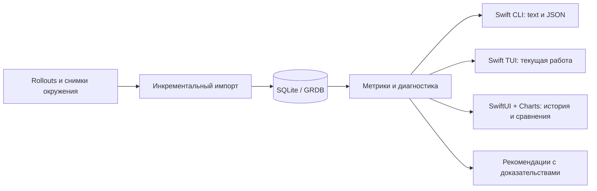

# Codex monitoring: архитектура и границы MVP

Дата: 12 сентября 2026. Этот документ описывает архитектуру и границы MVP.
Приоритеты и статусы задач ведутся в [ROADMAP.md](ROADMAP.md). Первый CLI/GUI slice реализован;
фактические возможности, проверки и ограничения перечислены в [README](README.md).
Выбранное пользователем направление реализации: нативный macOS, Swift и SPM.
Dogfooding: SpecificationCore для общих правил/CLI, SpecificationKit для GUI
features, FSD для GUI architecture/tooling. NavigationSplitViewKit используется
как референс поведения навигации, по уточнению пользователя.
Стандартная инфраструктура строится на Apple SDK и проверенных open-source
компонентах. Reuse policy, SwiftLint/Makefile, build tools и signing описаны в
[quality-and-reuse.md](quality-and-reuse.md); подготовлены starter configuration files.
Приложение и repository называются `SessionMonitor`; CLI executable — `codex-monitor`.

## Задача продукта

Помогать понимать, какие сессии и способы работы расходуют ресурсы, обнаруживать
изменения после обновлений моделей/harness и проверять пользу настроек. Оптимизация
оценивается по расходу на принятый результат, времени и качеству; cache hit — одна
из диагностических метрик. Когда результат или качество не размечены, интерфейс
показывает расход и наблюдаемые сигналы, но не объявляет работу бесполезной.

Основание: [локальный аудит](report.md) за 5–12 сентября: 6 340 уникальных responses,
775 583 024 input, 747 037 312 cached input, cache hit 96,319%. Высокое повторное
использование контекста сосуществовало с частыми вызовами в больших сессиях.
В одном эпизоде было 18 одинаковых ожиданий code cell за примерно пять минут.
Часть грубых счётчиков сильно завысила расход из-за скопированной истории fork.
Эти наблюдения обосновывают метрики и проверки, но не универсальные пороги тревог.

## Одно ядро, три интерфейса



CLI, TUI и GUI линкуют общие Swift library products и используют одну типизированную
query/domain API. GUI вызывает ядро напрямую внутри своего процесса; для него
не требуется локальный HTTP server или запуск CLI. TUI использует те же DTO и
расчёты, но собственное представление. SwiftUI views остаются в macOS app target.
XPC имеет смысл позднее, если появится отдельный постоянный background helper.

Первый адаптер — локальные Codex CLI/Desktop rollouts на macOS. Интерфейс адаптера
оставляет возможность других harness, но реализация нескольких поставщиков не
входит в первый этап. App и terminal CLI учитываются как разные installations:
их версии могут различаться, как на этом Mac.

Parser и расчёты реализуются на Swift с первого этапа. Существующий Python
[audit_codex.py](audit_codex.py) служит reference implementation при переносе и
локальным regression oracle. В распространяемом приложении Python runtime не
нужен. Перенос сохраняет правила ownership/dedup и явные ограничения измерений;
совпадение основных сумм проверяется на зафиксированном наборе событий.

## Нативный стек и SPM

| Часть | Выбор | Граница зависимости |
| --- | --- | --- |
| Язык и выполнение | Swift 6 language mode, structured concurrency | UI state на MainActor; импорт и запросы выполняются вне main actor |
| CLI | Apple `swift-argument-parser` | Зависимость только CLI target; async subcommands через AsyncParsableCommand |
| Общие правила | SpecificationCore | MonitorPolicies: predicates и typed decisions для CLI и runtime |
| Логика GUI features | SpecificationKit | Реактивные specs в GUI slices; общие domain rules остаются в MonitorPolicies |
| Storage | SQLite через GRDB.swift | SQL, migrations и транзакции внутри MonitorStore |
| macOS GUI | SwiftUI, Swift Charts, AppKit для нужных интеграций | Apple SDK frameworks, не внешние SPM packages |
| Навигация GUI | SwiftUI NavigationSplitView по примеру NavigationSplitViewKit | Собственная SessionNavigationState; reference, не обязательная library dependency |
| Архитектура GUI | FSD пользователя | Pages First, slice boundaries, fsd-ios lint и generator как developer tooling |
| Файлы и наблюдение | Foundation и FSEvents | Адаптер Codex/macOS; потоковое чтение JSONL и восстановление по offsets |
| TUI | Кандидат SwiftTUI/swift-tui | Отдельный target после проверки; не зависимость ядра или macOS views |
| Проверки | Swift Testing; UI smoke tests приложения | Fixtures для parser, БД и общего query contract |
| Quality tooling | SwiftLint, Makefile и FSD lint | Общие воспроизводимые local/CI checks; build/test через swift и xcodebuild |
| Agent build workflow | XcodeBuildMCP | Использует те же project/scheme/settings; подключение проверяется перед первой app build session |

Проверенные 12 сентября release metadata: ArgumentParser **1.8.2** (Apache-2.0),
GRDB **7.11.1** (MIT). Это исходные версии для первой сборочной проверки, не
заявление, что приложение с ними уже собрано. SPM constraints и Package.resolved
фиксируют воспроизводимый dependency graph; обновления проходят проверки parser
и storage. Учитываются license notices прямых и транзитивных зависимостей.

Для TUI кандидат **SwiftTUI/swift-tui 0.13.0**: upstream указывает Swift 6.3+,
macOS 15+ и pre-1.0 статус. Перед выбором проверить таблицы, фильтры, resize,
Unicode/кириллицу, keyboard navigation, завершение по Ctrl-C с восстановлением
терминала и обновления без мерцания. Ограничить version range по minor, как
рекомендует upstream. Основной код MIT; vendored компоненты имеют свои notices.
Под названием SwiftTUI существуют разные repositories — dependency URL задаётся
явно. Проверка TUI не блокирует нативный GUI.

Предлагаемая структура одного repository:

```text
Package.swift
Sources/
  MonitorCore/       # value types, метрики и DTO
  MonitorPolicies/   # domain rules на SpecificationCore, findings с evidence
  CodexSource/       # версия формата, JSONL decoder, offsets, FSEvents
  MonitorStore/      # GRDB, schema, migrations, запросы и atomic import batches
  MonitorRuntime/    # import/watch lifecycle и публичный query service
  MonitorCLI/        # ArgumentParser и text/JSON output
Tests/
  MonitorCoreTests/
  CodexSourceTests/
  MonitorStoreTests/
Apps/
  MonitorMac/        # Xcode app target, assets и signing
    Sources/         # app/pages/widgets/features/entities/shared по FSD
```

MonitorCore не зависит от UI и БД. MonitorPolicies зависит от Core и SpecificationCore;
CodexSource и MonitorStore зависят от Core. Runtime соединяет их и предоставляет
API клиентам. CLI и macOS app подключают Runtime. GUI features используют
SpecificationKit и переиспользуют применимые domain specs из MonitorPolicies.
Слои GUI относятся к исходникам приложения; они не дублируют canonical domain DTO.
Дополнительный TUI target появляется на своём этапе, без пустого scaffold
в первом commit. Один package с несколькими targets достаточен для ядра и CLI;
отдельные repositories для модулей не нужны.

Роли библиотек, просмотренные API, reference navigation и критерии adoption
зафиксированы в [плане dogfooding](dogfooding-plan.md). SpecificationKit уже
зависит от SpecificationCore; совместная сборка должна разрешить одну согласованную
версию Core. FSD применяется к GUI через свой configuration root и architecture
checks. В CLI/core сначала используются его принципы dependency direction и
явных SPM boundaries; UI layers там не создаются без предметной необходимости.

SPM управляет модулями и внешними библиотеками. Для устанавливаемого `.app` выбираем
обычный Xcode macOS app target с зависимостью на локальный package: там находятся
bundle metadata, assets, signing и entitlements. Такой способ поддерживает
`swift build`/`swift test` для ядра и CLI и отдельную сборку app через Xcode.

На машине проверен **Apple Swift 6.4**, выбран
`/Applications/Xcode-beta.app/Contents/Developer`, host target
`arm64-apple-macosx27.0.0`. Начальный deployment target предлагается macOS 15+;
он задаётся отдельно от установленной beta OS. Минимальный tools version и
совместимость конкретных package versions закрепляются после build smoke test,
а CI затем проверяет выбранный стабильный toolchain и beta как дополнительную
матрицу. Проверка `swift --version` сама по себе не подтверждает сборку dependencies.

## Достоверный импорт

Канонические сущности: installation, session, turn, model request, tool event,
compaction, configuration/capability snapshot и диагностическое finding.
Каждая запись содержит происхождение: файл, byte offset/строку, parser version,
event time и время наблюдения. Связь parent/subagent/fork хранится явно, когда
есть свидетельство. Неизвестную связь нельзя достраивать только по названию.

Требования к parser:

- Дедупликация canonical usage по устойчивому response ID с учётом источника;
  conflicting records сохраняются как конфликт, а не складываются.
- Зеркальный `token_count` не прибавляется к `token_usage_record`. Legacy counters
  требуют differencing, обработки reset и отдельной пометки достоверности.
  Поздний canonical record должен согласовываться с оценкой, а не удваивать её.
- Fork replay проверяется по ownership, исходному turn time и доступным признакам
  наследования. Внешний timestamp сам по себе не доказывает новый вызов модели.
- Parent и children можно показывать отдельно или суммарно по дереву; запросы
  не учитываются одновременно как собственные и как повторно добавленные дочерние.
- Отсутствующее поле — `unknown`, а не ноль. В частности, текущий audit script
  нормализует отсутствующие cache-write поля в 0; продукт должен сохранить разницу
  между отсутствием телеметрии и наблюдаемым нулём.
- Импорт обрабатывает незавершённую последнюю JSONL-строку, append, rotation,
  truncation и повторный запуск. Offset и новые события фиксируются одной
  транзакцией. Повторный импорт того же диапазона не меняет суммы.
- Для неизвестного формата сохраняется диагностическая запись и coverage;
  нельзя молча выдавать неполный отчёт за полный. Зафиксированный parser version
  позволяет воспроизводить расчёт и переиндексировать данные после исправления.

В Swift importer читает файлы порциями, выделяет завершённые JSONL records и
декодирует их через Foundation JSONDecoder/Codable в versioned event types.
Собственный JSON parser не разрабатывается. Большой архив не загружается целиком в
`Data` или массив строк. Неизвестные event variants попадают в диагностику.
Token counts хранятся целыми Int64 с проверкой некорректных значений/overflow;
проценты вычисляются при формировании отчёта. DTO для передачи между задачами
проектируются как Sendable value types.

SM-105 использует checkpoint v2: identity открытого файла (device/inode/birth time),
size, mtime/ctime, byte offset последнего newline, абсолютный номер строки и
нормализованный ownership/model context. Неполная строка остаётся в source;
её содержимое в checkpoint не копируется. При неизменных метаданных body не читается.
Рост той же identity считается append-only: decoder читает от durable offset без
проверки старого prefix, в том числе после перезапуска. Поэтому rewrite-plus-growth
требует явного `--rescan`; это принятый scope, а не гарантия filesystem или producer.
Несовместимый checkpoint (включая v1), truncation, новая identity или изменение
metadata без роста дают полный rescan.
Проверки descriptor metadata до и после чтения отклоняют изменившийся snapshot.
GRDB transaction одновременно сохраняет записи, diagnostics и новый checkpoint;
compare-and-swap по прежнему blob не позволяет stale batch затереть более новый.
`partialTails` — текущее состояние хвоста, остальные source diagnostics на append
накапливаются. `--rescan` принудительно пересобирает выбранные source snapshots.

SM-102 уточняет recovery contract. Directory scan выбирает обычные `*.jsonl` и
несжатые archives `*.jsonl.[0-9]+`; hidden и compressed files не импортируются.
Rename/copy получает отдельный snapshot по новому path, canonical dedup остаётся
глобальным. Отсутствующий path не удаляется: его diagnostics описывают последнее
наблюдение, поэтому старый partial tail после rename может остаться в отчёте.
Replacement/truncation пересобирает snapshot этого path и сбрасывает ownership/model
context; без нового metadata/native-turn evidence usage не наследует старую ownership.
При rotation старое поколение сохраняется через импорт archive. Хранилище не является
immutable журналом всех версий файла, а транзакции по-прежнему ограничены одним source.

Runtime сериализует ingest внутри процесса, а межпроцессный lock на конкретное
хранилище разрешает только одному importer/watch одновременно менять index.
SQLite transactions/WAL отвечают за согласованность и параллельное чтение.
Один Swift actor не заменяет межпроцессный lock. GUI и CLI используют один
настраиваемый store path и проверяют schema compatibility. При занятом importer
CLI читает существующий snapshot с watermark; попытка создать второго importer даёт
`importerBusy`. SM-104 удерживает flock на весь lifecycle SessionWatch, включая pause
и recovery. Внутренние imports используют этот lease; stop сначала join/cancel worker,
затем release. Descriptor имеет close-on-exec, release идемпотентен, файл lock не удаляется.
Перед выбором sidecar lock файл БД открывается с O_CREAT без truncation, затем
канонизируется realpath. Это учитывает и dangling symlink при первом запуске.
WAL setup и migrations сериализованы отдельным коротким setup lock: новый reader может
открыть БД при работающем watch. После process death ОС освобождает оба flock.

SM-104 предоставляет Codable `UsageQuery` / `UsageSnapshot` в MonitorCore и общий runtime
API `snapshot(query:)` / `snapshots(query:)`. Schema version 1 включает absolute half-open
period, timezone identifier, canonical report, cache coverage (empty/partial/complete)
и `QueryWatermark` (database UUID, revision, optional committed-at). Diagnostics имеют
all-imported-sources scope. Revision продвигается в transaction records/diagnostics/checkpoint,
в том числе при historical correction; unchanged source не продвигает revision.
Миграция existing index даёт revision 0 без выдуманного timestamp. Report и marker читаются
в одной GRDB DatabaseQueue.read transaction. Marker показывает commit index, не scan completion.

GRDB 7.11.1 ValueObservation не отслеживает external processes (pinned документация:
`GRDB/Documentation.docc/DatabaseSharing.md`, раздел Cross-Process Database Observation).
Поэтому каждый consumer проверяет одну metadata row раз в секунду и только при новом
marker вычисляет агрегаты. Это bounded native polling без raw log reads; промежуточные
commits могут объединяться, AsyncThrowingStream хранит последнее значение. Cancellation
останавливает task; errors завершают stream с сохранением последнего GUI report. GUI window
владеет observation через SwiftUI .task; обновление проходит через тот же SpecificationKit
provider с сохранением фильтра и reconciliation selection. SQL writes вне UsageStore без
marker не поддерживаются. Замена SQLite-файла требует reopen runtime; это не source rotation.
CLI `snapshot --follow` использует тот же stream и не приобретает importer lease.

Verification SM-104: contract/atomic-read tests используют независимые GRDB connections;
process smoke проверяет external commits, idle suppression, concurrent first migrations,
watch contention/paused ownership, symlink alias и SIGKILL recovery. GUI test читает commit
от отдельного SQLite process; production marker publication проверяется CLI harness.

FSEvents служит уведомлением о возможных изменениях. Debounce объединяет bursts,
затем importer проверяет file identity/size и читает новые bytes. При lost events,
root change или сомнительном checkpoint выполняется rescan нужного дерева с
сохранением dedup. Само получение notification не продвигает durable offset.
При старте и восстановлении после сна выполняется reconciliation по метаданным.
Для UI observation внутри процесса и обновлений от другого процесса используются
явно проверенные механизмы; наличие GRDB ValueObservation само по себе не является
доказательством, что внешний writer автоматически обновит открытый экран.

В SM-103 `SessionWatch` владеет stream и отдельной от importer actor state machine.
Stream регистрируется до initial scan; один native callback batch даёт одно уведомление.
Первое событие открывает ограниченное debounce window, новые события не отодвигают
его конец. Pending/re-attach flags сохраняются при текущем import. Любое обновление
использует full-tree incremental reconciliation, включая dropped/coalesced events.
Ошибки сохраняют pending state, переоткрывают stream и повторяют попытку с backoff 1–30 s.

Наблюдение за parent замечает удаление и восстановление logical root. Фильтр хранит
physical paths через `realpath`, включая ещё отсутствующие descendants существующего
ancestor: Foundation может сокращать `/private/var` только пока entry существует.
Discovery заново читает metadata root и исключает собственные DB/WAL/SHM/lock paths.
Pause прекращает запуск новых imports и ждёт текущий; resume всегда сверяет дерево.
Stop отменяет конкретную import task, ждёт её завершение и выполняет Stop/Invalidate/Release.
Generation tokens отбрасывают queued callbacks и timers предыдущего stream.

CLI `watch` выводит bounded latest status stream как JSON lines; signals управляют
pause/resume/stop. Cancellable nonblocking stdout и 250 ms drain deadline позволяют
завершиться при открытом, но переполненном downstream pipe. Swift runtime остаётся
нативным; Python standard library используется только в process test harness.
GUI controls, query snapshots и межпроцессный watch owner не входят в SM-103 (см. SM-104).

Rollouts читаются локально и не изменяются. В БД достаточно чисел, идентификаторов,
классов событий и source pointers; полные prompts, tool outputs, credentials и
содержимое `auth.json` не нужны. Для сопоставления повторов допустим локальный
digest нормализованных аргументов/статуса. Экспорт по умолчанию обезличивает названия
и пути; доступ к полному локальному свидетельству — явное действие пользователя.

## Метрики

| Группа | Что показывать | Как интерпретировать |
| --- | --- | --- |
| Usage | Input, cache read, cache write при наличии, output и reasoning | Reasoning не прибавлять повторно к output |
| Cache | `sum(cached_input) / sum(input)` для записей с известными полями, coverage | Не среднее процентов отдельных запросов; нулевой denominator → N/A |
| Context | Input p50/p90/max, рост по запросам, compactions | Размер запроса — наблюдение; token count не показывает релевантность истории |
| Activity | Responses/turn, calls/minute, tool classes, повторные ожидания | Повтор аргументов ещё не доказывает отсутствие прогресса |
| Orchestration | Parent/child usage, startup, число workers, завершения и handoffs | Принятие результата требует явного события или пользовательской отметки |
| Experience | Длительность сессии/turn, ошибки, rework при доступной разметке | Wall time не равен model latency; TTFT показывать только из соответствующих данных |
| Limits | Реальные snapshots использованных лимитов и reset time, если доступны | Возраст snapshot обязателен; токены не конвертировать в проценты подписки |

`input - cache_read` показывает input, не прочитанный из cache; он может включать
cache writes. Разбиение на обычный input/cache read/cache write и денежную оценку
разрешает только адаптер с подтверждённой семантикой полей и актуальными тарифами
конкретного billing mode. Для подписки по этим данным нельзя вычислять счёт API.

Cache сравнивается отдельно для первого запроса turn и последующих, с учётом
модели, effort, provider, installation/harness version, размера input и compaction.
Общий недельный процент скрывает различия между этими группами. Переход на новую
сессию оценивается вместе со startup и качеством, даже если её cache hit ниже.

Диагностика различает факт, эвристику и гипотезу. Например: повторный status без
изменений можно подтвердить выходом инструмента; по одинаковым arguments это лишь
кандидат. Рост input после обновления — корреляция, пока не исключены смена задач,
модели, effort и другие изменения. Server-side причина cache miss показывается
только если harness действительно сохранил соответствующую диагностику.

## Адаптация к моделям и harness

Хранить последовательность snapshots: executable path/version, app build,
наблюдаемый model ID и model catalog revision/hash, поддерживаемые capabilities,
allowlist относящихся к задаче настроек и версия правил диагностики. Снимок
конфигурации, сделанный сегодня, не доказывает конфигурацию прошлых turns. Приоритет
имеют записанные per-turn effective values; происхождение и неизвестные значения
видны пользователю. Alias модели не гарантирует неизменность серверного deployment.

Цикл адаптации:

1. **Detect:** обнаружить новую версию/возможность и границу периода наблюдений.
2. **Explain:** проверить совместимость и предложить конкретное изменение с
   источником, ожидаемой пользой, ограничениями и затрагиваемыми clients/profiles.
3. **Evaluate:** сравнить старый и новый вариант на сопоставимых задачах; менять
   один фактор за раз. Включить startup, повторную работу, время и качество.
4. **Adopt or rollback:** принять изменение по результату или вернуть прежнее;
   сохранить diff, проверенные версии и результаты эксперимента.

Первый релиз даёт рекомендации. Автоматическое редактирование настроек — отдельная
последующая возможность с явной политикой пользователя. Конкретный apply должен
проверять исходное состояние config, сохранять backup и комментарии, менять только
нужные поля и проверять parse всеми затронутыми clients. Именно различие версий
CLI 0.145.0 и app harness 0.153.4 ранее мешало записать structured sleep config.
После обновления CLI до 0.154.0 обе установки его приняли.

Не переносить API cache options в `config.toml` без подтверждённого соответствия
в установленном harness. Возможности API, доступные настройки клиента и фактически
записанная телеметрия — три отдельные вещи. Официальная документация уже различает
cache-поведение поколений моделей; источник и дата проверки входят в capability
rule. При неизвестной версии diagnosis остаётся доступным, а неподтверждённое
исправление помечается как неприменимое/непроверенное.

Проверка release metadata может быть отдельной командой или явно включённой
фоновой функцией. Она отправляет только запросы к публичным источникам версий;
локальные сессии для этого не нужны. Мониторинг журналов не вызывает LLM и не
создаёт Codex turns. LLM-интерпретация отчёта, если понадобится, будет отдельным
пользовательским действием с видимым объёмом передаваемых данных.

## План реализации и CLI contract

Этапы, зависимости, критерии готовности и выполнение находятся в [ROADMAP.md](ROADMAP.md).
Этот документ сохраняет архитектурные требования; отдельный список статусов здесь не ведётся.
Build/test entry points и подпись описаны в [quality workflow](quality-and-reuse.md),
обязательное ведение плана — в [CONTRIBUTING.md](CONTRIBUTING.md).

Расширенный CLI command surface ниже — предложение. Реализованные `import` / `report`
и их текущие flags описаны в [README](README.md); приведённый здесь синтаксис целиком ещё не поддерживается:

```text
codex-monitor import --since 2026-09-05 --until 2026-09-12 --timezone Europe/Moscow
codex-monitor report --last 7d --group-by model,harness
codex-monitor sessions --sort uncached-input
codex-monitor inspect <session-id>
codex-monitor doctor
codex-monitor report --last 7d --format json
```

Документировать семантику интервалов: правая граница исключена, timezone выводится
в отчёте. Query response содержит schema version, диапазон, applied filters,
coverage, фактические метрики, findings с evidence и data watermark. Один и тот же
query contract служит всем интерфейсам. `watch`, `compare` и `apply` добавляются
по этапам; stable JSON важнее количества первых команд.

TUI отвечает на «что происходит сейчас и куда уходит расход». GUI отвечает на
«что изменилось, после какого релиза и в каких задачах». Такое разделение даёт
каждому интерфейсу самостоятельную пользу при общих данных.

## Menu bar и виджеты

Добавлено по запросу пользователя 12 сентября 2026. Статус реализации — в
[ROADMAP.md](ROADMAP.md), задачи SM-201/SM-202 и SM-401/SM-402.
Пользователь подтвердил системные macOS widgets на рабочем столе и
в Notification Center. Карточки внутри окна не входят в это уточнение.
WidgetKit extension и FSD layer `widgets` — разные
понятия: слой FSD появляется для реально повторно используемых UI blocks.

### Menu bar

SM-201 реализует read-only панель на UsageSnapshot. После SM-301 `SharedReportRuntime`
в app layer разделяет один upstream stream для каждого равного `UsageQuery` между окнами
и menu bar, кэширует последнее значение и отменяет upstream после последней подписки.
Разные queries изолированы. Навигация и SpecificationKit providers остаются per-window.
Model панели получает только query-aware stream factory без import/watch API.
App-owned report scope предлагает All Time, Today, Last 7 Days и Last 30 Days в UTC
или текущей local timezone и сохраняет выбор. Calendar ranges выравниваются по полуночи
выбранной зоны с half-open семантикой и корректным DST. Sidebar search остаётся
presentation filter: он не меняет accounting totals или canonical query.
Cache coverage берётся из общего query contract.
SM-202 добавляет app-owned `AppWatchController`: выбранная через NSOpenPanel папка
запускается явно, один handle и один status consumer живут независимо от окон.
Панель получает presentation и actions из app layer; внешний CLI watcher не публикует phase в БД.
Свежесть показывается как время commit индекса, без вывода о свежести исходных logs.
Refresh читает snapshot без импорта. Settings сохраняют видимость значка через AppStorage.
App delegate перехватывает Quit и отвечает после shutdown, включая pending start.
Следующие расширения метрик и routing остаются целевым scope последующих задач.

SwiftUI `MenuBarExtra` дополняет существующее окно Session Explorer. Значок показывает
состояние мониторинга; компактная панель содержит расход за выбранный период,
cache hit/coverage, время обновления и значимые findings. Количество активных сессий
добавляется после появления достоверной модели activity, а не выводится только из
наличия записей в БД. Возможность показывать одну выбранную метрику рядом со значком
проверяется с учётом ограниченного места в menu bar.

Действия: открыть SessionMonitor, обновить данные, pause/resume watch, настройки,
выход. Pause относится к наблюдению за файлами и явно отличается от устаревших данных
или ошибки импорта. Панель использует общий runtime и query snapshot; открытие меню
не создаёт importer и не запускает полный rescan. Изменения публикует работающий
watch с debounce; для этого не нужны LLM calls или частый таймер чтения logs.

В `App` используется overload MenuBarExtra с `isInserted` binding рядом с WindowGroup.
Видимость сохраняется как пользовательская настройка. Закрытие основного окна
сохраняет watch, в том числе при скрытом значке; удаление значка не закрывает окна.
Quit завершает работу и освобождает importer lock. Open Window открывает Session Explorer
с текущим app-owned period/timezone. Routing к выбранной сессии остаётся будущим расширением.

### Системные widgets

Первый набор: «Расход» (input/cached/uncached за сегодня или 7 дней) и «Cache»
(ratio, coverage, мини-график после появления timeline query). Начать с small и
medium layouts. Каждый widget показывает период и время последнего обновления;
unknown, отсутствие данных, пауза и устаревший snapshot имеют отдельные состояния.
Нажатие открывает соответствующий отчёт SessionMonitor с тем же фильтром.

WidgetKit живёт в отдельном extension target. App и extension используют App Group
с корректными entitlements/signing для существующей Apple Developer Team.
Начальный transport — небольшой versioned Codable snapshot, атомарно публикуемый
основным runtime в shared container. Extension читает этот snapshot и не сканирует
rollouts, не становится вторым importer и не запускает модель. Полная БД остаётся
у runtime; для первого widget не требуется миграция всего хранилища в App Group.

Snapshot содержит границы периода/timezone, watermark, coverage и агрегаты;
его контракт общий с CLI/GUI. WidgetKit получает timeline, а приложение запрашивает
reload после значимого изменения snapshot с coalescing. Система определяет фактическую
частоту обновлений; секундная свежесть не обещается. Если источник не обновлялся,
widget сохраняет последнее наблюдение и явно показывает его возраст.

### Порядок и проверки

Порядок реализации и зависимости зафиксированы в [ROADMAP.md](ROADMAP.md).
Существующие SpecificationCore policies используются для
coverage/freshness decisions, SpecificationKit — для реактивных GUI features.

Критерии: одинаковые метрики и диапазоны во всех поверхностях; отсутствие второго
importer; idle CPU и число disk reads не растут от открытого menu bar/widget;
корректные stale/unknown states и deep links; macOS layouts в нескольких размерах;
проверенная подпись App Group/extension. Просмотр меню, закрытие окна и refresh
widget не меняют уже посчитанный расход.

Источники проверены через Apple DocumentationSearch в Xcode MCP:
[MenuBarExtra с isInserted](https://developer.apple.com/documentation/swiftui/menubarextra/init(isinserted:content:label:)),
[WidgetKit shared container](https://developer.apple.com/documentation/widgetkit/developing-a-widgetkit-strategy),
[timeline и update budget](https://developer.apple.com/documentation/widgetkit/keeping-a-widget-up-to-date).

## Проверка MVP

- Сохранённый недельный аудит служит локальным regression oracle: 6 340 requests
  и те же суммы на той же зафиксированной выборке. Историческое `cache_write = 0`
  не превращать в доказательство отсутствия writes: сравнивать поля с учётом coverage.
- Synthetic fixtures покрывают fork replay с переписанными timestamps, зеркальные
  счётчики, late canonical events, duplicate/conflicting IDs, reset, missing fields,
  partial JSONL, rotation/truncation и восстановление после сбоя.
- Два одинаковых imports и повторный запуск watch не меняют уже посчитанный расход.
  События parent/child дают одинаковый общий итог независимо от представления дерева.
- Ошибочный/новый формат порождает видимое снижение coverage; отчёт не выдаёт нули
  за отсутствующие данные. UI сверяется с тем же query, что CLI JSON.
- Performance baseline снимается на реальном архиве: время первого import,
  incremental update, bytes read, peak memory и размер БД. Повторное обновление
  читает только новые/изменённые данные, кроме явно запрошенной переиндексации.
- Диагностика false positives проверяется на первом запросе turn, полезном долгом
  ожидании, нормальной compaction и смене модели. Один miss не запускает config apply.
- Swift Testing покрывает расчёты, decoder и storage на fixtures; временные SQLite
  stores позволяют проверять restart и atomic batches. Отдельный process test
  проверяет два одновременно запущенных clients и исключительность importer.
- Первый GUI slice показывает недельный отчёт из той же БД и результаты того же
  query, что CLI. Проверяется отзывчивость во время import и отсутствие обращения
  SwiftUI views напрямую к raw rollouts. В production runtime нет вызова Python parser.

Результат первой итерации — надёжное объяснение наблюдаемого расхода и конкретные
кандидаты на улучшение. Заявление об экономии появляется после сравнительного
измерения. Полный marketplace профилей, remote sync, универсальный multi-provider
monitor и автономный optimizer не входят в первый MVP.

## Связь со скиллом

Обновлённый [Parallel Subagent Orchestrator](/Users/egor/.codex/skills/parallel-subagent-orchestrator/SKILL.md)
выбирает форму выполнения, границы контекста и ожидание. Монитор даёт ему измеримые
свидетельства: где появилась лишняя работа, какова стоимость startup и улучшилась
ли новая стратегия. Скилл использует краткий отчёт, когда он нужен для решения;
он не запускает полный недельный аудит перед каждым spawn и не опрашивает monitor
каждые несколько секунд. Автоматизация не должна воспроизводить проблему, которую
мы устраняем.

## Источники и ограничения

- [Локальный аудит и методика](report.md), [parser](audit_codex.py),
  [независимая проверка](verification.json). Это snapshot до последующего обновления
  CLI и sleep config, а не текущие настройки машины.
- [OpenAI: Subagents](https://learn.chatgpt.com/docs/agent-configuration/subagents):
  независимая работа и краткие результаты помогают разгрузить основной контекст;
  каждый subagent сам выполняет model/tool work и увеличивает token usage.
- [OpenAI: Prompt caching](https://developers.openai.com/api/docs/guides/prompt-caching):
  prefix matching, model-dependent behavior, cache read/write и влияние настроек.
  Документация API не доказывает доступность этих полей или настроек в Codex logs.
- [Apple: локальные Swift packages](https://developer.apple.com/documentation/xcode/organizing-your-code-with-local-packages)
  и [Swift Charts](https://developer.apple.com/documentation/charts): общий package
  подключается к app target; Charts предоставляет нативные SwiftUI charts.
- [ArgumentParser 1.8.2](https://github.com/apple/swift-argument-parser/releases/tag/1.8.2)
  и [GRDB 7.11.1](https://github.com/groue/GRDB.swift/releases/tag/v7.11.1): выбранные
  начальные версии для build verification, внешние зависимости через SPM.
- [SwiftTUI/swift-tui](https://github.com/SwiftTUI/swift-tui): кандидат для TUI,
  pre-1.0; заявленные платформы, compiler minimum и dependency policy.
- [Apple: FSEvents](https://developer.apple.com/library/archive/documentation/Darwin/Conceptual/FSEvents_ProgGuide/UsingtheFSEventsFramework/UsingtheFSEventsFramework.html):
  события могут объединяться и теряться; flags определяют необходимость rescan.

Официальные страницы проверены 12 сентября 2026. Архитектура предполагает дальнейшую
проверку совместимости по реальным версиям, а не бессрочную фиксацию сегодняшних правил.
