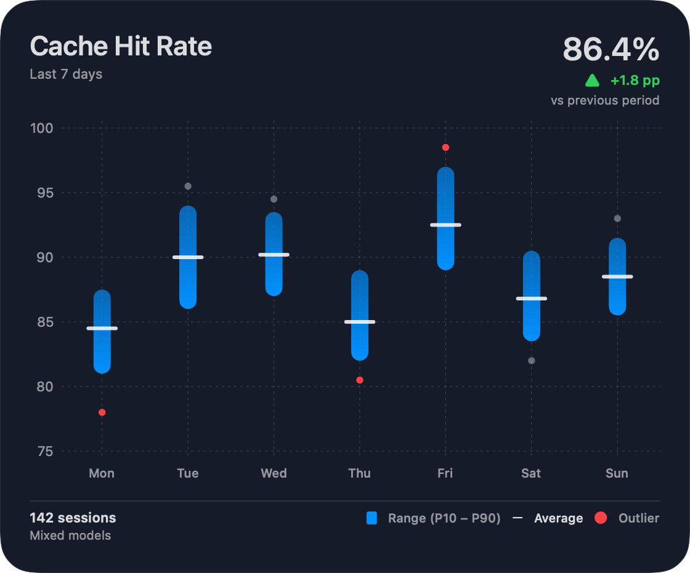

# SM-311 — Cache Hit Rate Widget Family

Дата: 2026-09-19  
Ветка: `feat/sm-311-cache-hit-widget-family`  
Статус: частичная реализация, PR #29 открыт.

## Результат этого этапа

Старый `SessionCacheHitChart` показывал один bar на session, его model/session labels и
selection противоречили новому privacy contract. Он удалён из sidebar и заменён на
`CacheHitRateWidget`: reusable SwiftUI composition, принимающая только
`CacheHitRateWidgetReport`. Public presentation model не содержит session ID и model.

`MonitorCore/CacheHitRateWidget.swift` строит report из минимальных read-only observations:

- weighted period rate и delta к immediately previous equal period;
- hourly buckets для 24h и daily buckets для 7d/14d/30d в выбранной timezone;
- per-bucket P10–P90 и weighted average;
- min/max fallback для менее четырёх session samples;
- robust-z outliers на median/MAD, ограниченные presentation family limit;
- `noData`, `partialCoverage` и `notApplicable` без подмены unknown нулём.

Текущий canonical record хранит `input` и optional `cached`, но не отдельное поле
`cacheable_input_tokens`; в этом source adapter `input` является cacheable denominator,
как и в существующем cache-hit contract. Если producer начнёт отдавать отдельный
denominator, его нужно добавить в `UsageRecord` и заменить mapping без изменения
presentation formulas.

`CacheHitRateWidgetAppearance` содержит semantic palette, copy/legend strings и layout
tokens. `CacheHitRateWidgetSettings` хранит 24h/7d/14d/30d в `UserDefaults`; текущий
in-app card реагирует на snapshot revision и настройку периода без reimport. Она также
пересчитывает rolling window на каждой следующей границе local hour, чтобы records
своевременно выходили из window и hourly buckets для 24h сдвигались без нового import.

## Deterministic visual iteration — 2026-09-20

В Debug build доступно **Window → Widget Lab**. Оно использует production SwiftUI component,
но не читает и не изменяет SQLite, Settings или runtime snapshot. В Release lab и fixtures исключены.
Фиксированная дата — 2026-09-14 00:00 UTC. Можно менять family, ширину 220–720pt, light/dark,
монохромную палитру, длинные custom title/legend strings и Dynamic Type environment.

Сценарии: reference seven days, missing days, outliers below axis, weighted mean outside P10–P90,
one session, no data, partial coverage, zero cacheable input, 24 hourly buckets и 30 daily buckets.
Reference — presentation fixture по концепту (включая illustrative headline 86.4%/142 sessions),
а остальные сценарии проходят настоящий `CacheHitRateWidgetBuilder` на synthetic observations.
Reference не служит проверкой accounting; production данные им не подменяются.

Исправления presentation:

- Header/chart выделены в отдельные компоненты; семантические palette/copy/layout values общие.
- Aspect ratio 16:9 применяется к plot, а не к card вместе с заголовком/легендой.
- X labels позиционируются через `ChartProxy` по тем же координатам, что range и mean.
  При нехватке ширины используются single-letter weekdays; для dense periods прореживаются
  только labels, сами buckets сохраняются. Bars сужаются для 24/30 buckets.
- Пустые calendar slots сохраняются без фиктивных zero bars. Rolling 7d может пересекать
  восемь calendar days из-за partial first/last day; это не дублирование данных.
- Quarter-band Y-axis использует typical ranges, исключая isolated outliers. Ticks покрывают
  выбранный band (например, 50–100), а не всегда только 75–100.
- Убран display-clamp weighted average к P10–P90: он математически может быть вне этого
  невзвешенного диапазона. Marker остаётся на настоящем значении, с dashed connector к range.
  При значении ниже axis используется edge annotation; доступность содержит реальное значение.
- Убрано disabled Button wrapping: read-only card не затемняется и открывает AX descriptions.
  AX descriptions используют report timezone и не содержат session/model identities.

Воспроизведение: `rtk proxy make test-widget`. Это 16 targeted tests, включая render matrix из
15 PNG attachments в `.xcresult`: все 10 сценариев, medium/small, light, dense-small и narrow-large.
PNG snapshots предназначены для visual review; это не pixel-diff golden gate.

[Medium](assets/sm311/medium-dark.png) · [Small](assets/sm311/small-dark.png) ·
[Light](assets/sm311/large-light.png)

Текущие проверки:

- `make test-macos`: 73/73 passed до последних локальных chart/AX refinements.
  Первый запуск нашёл ошибку synthetic outlier fixture и timeout существующего
  `SharedReportRuntimeTests`; fixture исправлен, повторный полный запуск зелёный.
- Финальные targeted suites: 16/16 passed, включая 15 native SwiftUI renders.
- `make lint lint-architecture test-architecture`: passed; negative FSD fixture ожидаемо отклонён.
- `make build-macos`: passed; последующие builds также выполнены xcodebuild test.
- Native app: Widget Lab открыт через Window menu; проверены dark 560pt, light/monochrome
  320pt и 220pt, title fallback и weekday alignment. Sidebar startup также прошёл на реальной БД.
- Dynamic Type environment можно переключать, но системное увеличение текста macOS этим
  запуском не подтверждено. Наличие переключателя не считается accessibility acceptance.
- Xcode MCP build на этом этапе сообщил cancellation; использован `xcodebuild` fallback.
- `git diff --check`: passed. Canonical/Core/Store code в этом follow-up не менялся.

## Sidebar embedded presentation — 2026-09-20

Sidebar передаёт `containerStyle: .embedded`: нет отдельного фона, border, rounded rectangle
и card padding. Page задаёт единый section inset 16pt для выравнивания с header;
существующие dividers разделяют header, chart и list. `.card` сохраняет прежнее оформление
для standalone presentation. В Widget Lab добавлен переключатель Embedded.

Xcode MCP BuildProject/RunProject и CLI build прошли; SwiftLint/FSD — без нарушений.
`make test-widget`: 16/16 passed.
Native screenshot на текущей базе подтвердил встроенный график без обрамления (96.9%, +0.7pp).
При AX-проверке также убран лишний children-ignore с Text, скрывавший bucket descriptions.

## Light-mode axis-label contrast — 2026-09-22

The cache-level labels on the leading Y axis now use an explicit `AxisValueLabel` text
with the same neutral semantic palette role as the date labels rendered through
`ChartProxy`. This prevents the Charts default white label style from disappearing on
the light surface while preserving the selected system/monochrome palette.

Tracking and verification (2026-09-22): tracked separately as **SM-317** in
[ROADMAP.md](../ROADMAP.md), delivered by [PR #46](https://github.com/SoundBlaster/SessionMonitor/pull/46).
`make test-widget` passed (16/16), `make lint` passed with 0 violations, and the exported
`large-light` render fixture was visually inspected: Y-axis labels are legible against the
light chart surface. Workflow lint, Native checks, and CI passed for the PR revision; PR #46
merged as `e7abca5` on 2026-09-22.

## Предыдущие проверки (baseline, не повторялись целиком в visual follow-up)

- `make check-core` — полный core/CLI/performance smoke passed; новые 7 core tests passed.
- `make test-macos` — полный MonitorMac test plan passed.
- `make build-macos` — passed.
- `make lint` — 0 violations.
- `make lint-architecture` — 0 errors, 0 warnings.
- `make test-architecture` — expected negative FSD fixture detected; target exited successfully.
- `git diff --check` — passed.
- Xcode MCP `BuildProject` — passed; `RunSomeTests` for `CacheHitRateWidgetTests` — 4/4 passed.
- Native dark-mode AX and screenshot: card displays `97.0%`, `Last 7 days` and delta,
  while widget subtree exposes only aggregate distribution text; no session/model identity.
- Review regressions: targeted `CacheHitRateWidgetTests` — 7/7 passed, including weighted
  average axis, timezone-aware hourly label and next-hour refresh schedule.

## Remaining delivery

The card has no enabled tap destination yet because `cache_analytics` does not exist.
SM-401 will add an App Group, atomically published Codable snapshot and WidgetKit extension;
SM-402 will map this same card/report contract to macOS small/medium/large families and then
validate desktop-widget light/dark/Dynamic Type layouts. iOS/iPadOS host targets are not in the
current macOS-only Xcode project and therefore are not claimed by this stage.
